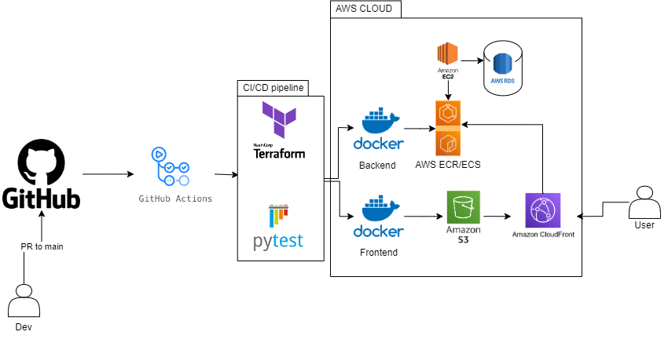

<h1 align="center"> Python Pizza Planet </h1>


This is an example software for a pizzeria that takes customizable orders.

## Table of Contents

- [Getting started](#getting-started)
- [Running the backend project](#running-the-backend-project)
- [Running the frontend](#running-the-frontend)
- [Testing the backend](#testing-the-backend)

## Getting started

You will need the following general tools:

- A Python interpreter installed. [3.8.x](https://www.python.org/downloads/release/python-3810/) is preffered.

- A text editor: preferably [Visual Studio Code](https://code.visualstudio.com/download)
- Poetry installed. You can install it from [here](https://python-poetry.org/docs/#installation).

- Extensions such as [Python](https://marketplace.visualstudio.com/items?itemName=ms-python.python) and [Live Server](https://marketplace.visualstudio.com/items?itemName=ritwickdey.LiveServer)

## Running the backend project

- Clone the repo

```bash
git clone https://github.com/ioet/python-pizza-planet.git
```

- Install all necessary dependencies and create a virtual environment in the root folder of the project

```bash
poetry install
```

- Activate the virtual environment (In vscode if you select the virtual env for your project it will activate once you open a new console window)

```bash
make active-env
```

- Start the database (Only needed for the first run):

```bash
make migrate
```

- Update the database schema (Only needed if you have made changes to the models):

```bash
make update-migrate
```
- Seed the database (Only needed if you want to populate the database with some fake data):

```bash
make populate-db
```
- If you want to use the hot reload feature set FLASK_ENV before running the project:

_For linux/MacOS users:_

```bash
export FLASK_ENV=development
```

_For windows users:_

```CMD
set FLASK_ENV=development
```

- Run the project with:

```bash
make run
```

## Running the frontend

- Clone git UI submodule

```bash
git submodule update --init
```

- Install Live Server extension if you don't have it from [here](https://marketplace.visualstudio.com/items?itemName=ritwickdey.LiveServer) on VSCode Quick Open (`Ctrl + P`)

```bash
ext install ritwickdey.LiveServer
```

- To run the frontend, start `ui/index.html` file with Live Server (Right click `Open with Live Server`)

- **Important Note** You have to open vscode in the root folder of the project.

- **To avoid CORS errors** start the backend before the frontend, some browsers have CORS issues otherwise

### Testing the backend

- Make sure that you have `pytest` and `pytest-cov` installed

- Run the test command

```bash
make test
```
##### Testing coverage

- To get the test coverage, run the following command:

```bash
make test-coverage
```
## Plan to deploy diagram
